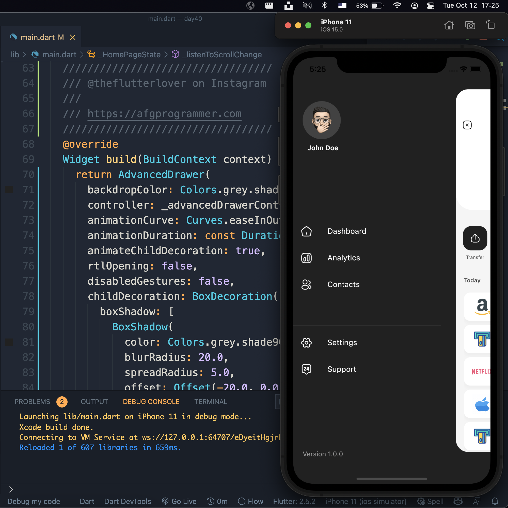

## Flutter Wallet Application Example - Day 40
 

Assets 
* [icon8](https://icons8.com)


## Development Setup
Clone the repository and run the following commands:
```
flutter pub get
flutter run
```

## Screenshots

### Home Page


### Contact Page


### Send Money Page


### Contact Page


## Links

* [Website](https://conveypride.github.io/)


